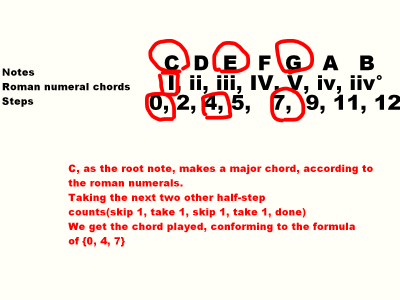
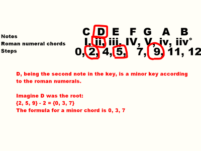

## Music Theory Bare Minimum
<h1>Tones, semitones</h1>
A tone is <b>2</b> steps up from a note, best visualized as being 2 piano keys to the right of a root note. For example, the note D is a tone (or whole step) up from C. A semitone (or half step) is <b>1</b> piano key to the right. Notated as W, h in this page.

<h1>Chords</h1>
Chords are collections of notes played simultaneously, done to convey a particular mood. For example, take C Major, made of notes C, F, G. The name says two things:
<ul>
    <li>The chord is based on the C note, and</li>
    <li>The chord is major</li>
</ul>
The major chord is one of the most useful — it conveys a simple, happy sound. Another widely used chord is minor, which is generally sad, though it matters how you use it, just like major.

You'll notice that C major (CFG,) when seen as a sequence of numbered piano keys, has the pattern 0, 4, 7. This is called integer notation, and this pattern is true for all major chords. For example, G major is made of notes G, B, D. 

<h1>Keys</h1>
Keys(not piano keys) are very imporant to understand. Keys are collections of notes larger than chords, but serve a similar purpose of setting mood. Just like chords, keys can be major or minor, but unlike chords, there is nothng beyond those two for keys. A key is made up from steps and half steps. Take a major key, represented by <ul>
    <li> W, W, h, W, W, W, h</li>
    <li>0, 2, 4, 5, 7, 9, 11, 12</li>
</ul> 
Notice, among others, the major key contains 0, 4, 7; the formula for a major chord.

Using the notes in keys to create chords, <b>scale degrees</b> are created. 

<h1>Scale degrees</h1>
i hate scale degrees but they arent that bad  
A major key has the following scale degrees:
I ii iii IV V vi vii°
<ul>
    <li>Uppercase: Major chord</li>
    <li>Lowercase: Minor chord</li>
    <li>°: dimished chord; dont worry about it for now</li>
</ul>

  

<h1>Chord Progressions</h1>
A chord progression uses scale degree chords, ordering said chords to create a feeling, whether that be progress, dread, or <b>utter hatred for all that moves. </b>  
The best example is the major "Axis of Awesome" progression, being made of scale degrees I, IV, V, and I, in that order. The idea is to build tension, and relieve it. By ramping up in dissonance(when notes dont go too well together) while remaining in harmony(the opposite), tension is built, and then relieved in the I.
